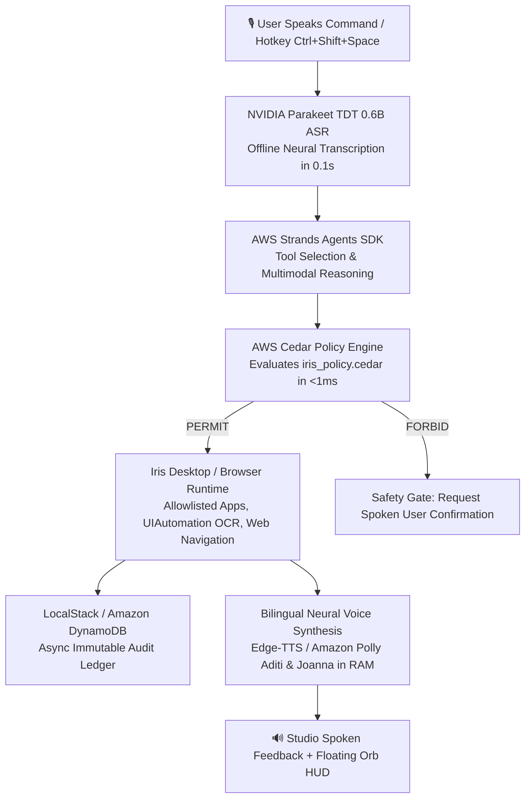

# ⚡ Iris — AWS Open-Source & Architecture Guide
### *Digital Braille for the Modern Computing Era — Powered by the AWS Open-Source Stack*

> **Track Focus: "Open Source, On Your Machine (BUILD IT)"**  
> **Core Principle: "NO AWS ACCOUNT. NO CREDIT CARD. NO BILL. 100% OPEN SOURCE ON YOUR MACHINE."**

Iris is an accessibility voice operating layer for Windows designed for individuals with motor disabilities, visual impairments, the elderly, and non-English/bilingual speakers. 

This document provides a comprehensive, engineering-level breakdown of **which AWS open-source technologies power Iris, why they were chosen, where they reside in the codebase, and how they execute on your local machine with zero cloud costs**.

---

## 📑 Table of Contents

1. [Hackathon Track Alignment: The "BUILD IT" Ethos](#1-hackathon-track-alignment-the-build-it-ethos)
2. [End-to-End System Flow](#2-end-to-end-system-flow)
3. [Deep Dive: The 3 Core AWS Open-Source Tools](#3-deep-dive-the-3-core-aws-open-source-tools)
   - [Tool 1: AWS Cedar Policy Engine (Local Rust Engine)](#tool-1-aws-cedar-policy-engine-local-rust-engine)
   - [Tool 2: AWS Strands Agents SDK (Agentic Tool Framework)](#tool-2-aws-strands-agents-sdk-agentic-tool-framework)
   - [Tool 3: LocalStack (Offline DynamoDB Audit Ledger)](#tool-3-localstack-offline-dynamodb-audit-ledger)
4. [Optional Cloud Scaling: The Hybrid Architecture](#4-optional-cloud-scaling-the-hybrid-architecture)
   - [Amazon Polly Neural (Bilingual Voice Streaming)](#amazon-polly-neural-bilingual-voice-streaming)
   - [Amazon Bedrock Converse API (Multimodal Reasoning)](#amazon-bedrock-converse-api-multimodal-reasoning)
5. [Live Visual Telemetry & Evaluation Proof](#5-live-visual-telemetry--evaluation-proof)
6. [Zero-Cost Local Parity Matrix](#6-zero-cost-local-parity-matrix)
7. [Automated Verification & Unit Tests](#7-automated-verification--unit-tests)
8. [Codebase File Map](#8-codebase-file-map)

---

## 1. Hackathon Track Alignment: The "BUILD IT" Ethos

Iris is architected specifically for the **Open source, on your machine (BUILD IT)** track:

> **Why Local Open Source Matters for Accessibility:**  
> Over 1.3 billion people worldwide live with disabilities, and 250 million citizens in emerging economies face digital literacy barriers. An accessibility tool that requires a $100/month cloud subscription, mandatory credit card details, or constant high-bandwidth internet connectivity fundamentally fails the people who need it most.

### How Iris Achieves 100% Local Parity:
* **Zero Cloud Lock-In:** Uses official **AWS Open-Source software (`cedarpy`, `strands-agents`)** running locally on CPU.
* **Deterministic Privacy:** Voice audio, screen OCR, and system metrics never leave the user's computer unless explicitly requested.
* **Seamless Cloud Upgrade:** If AWS credentials are optionally added to `.env`, Iris automatically scales to **Amazon Bedrock**, **Amazon Polly**, and cloud **Amazon DynamoDB** with zero code modifications.

---

## 2. End-to-End System Flow



---

## 3. Deep Dive: The 3 Core AWS Open-Source Tools

### Tool 1: AWS Cedar Policy Engine (Local Rust Engine)
* **Official Technology:** [AWS Cedar](https://www.cedarpolicy.com/) (Donated by AWS to the Linux Foundation), Python bindings: `cedarpy`.
* **Codebase Locations:**
  * Declarative Policies: [`actions/security/iris_policy.cedar`](file:///c:/Users/Mayank%20Garg/OneDrive/Desktop/Projects/iris-voice-assistant/actions/security/iris_policy.cedar)
  * Local Rust Evaluation Engine: [`actions/security/cedar_engine.py`](file:///c:/Users/Mayank%20Garg/OneDrive/Desktop/Projects/iris-voice-assistant/actions/security/cedar_engine.py)
  * Action Interceptor: [`actions/security/policy.py`](file:///c:/Users/Mayank%20Garg/OneDrive/Desktop/Projects/iris-voice-assistant/actions/security/policy.py)
* **Why Cedar Was Chosen:**  
  Hardcoded `if/else` checks in Python are error-prone and cannot mathematically guarantee safety when an AI assistant has access to the operating system. Cedar provides **declarative, provably sound Zero-Trust authorization**.
* **How It Works Locally:**  
  Before any desktop command or browser action is dispatched, `evaluate_cedar_policy()` compiles the execution context into an in-memory Cedar query evaluated by Cedar's Rust core in **`< 1ms`**:

```cedar
// 1. Unconditionally permit safe diagnostic queries
permit(
    principal == User::"VoiceUser",
    action in [
        Action::"SYSTEM_RAM",
        Action::"SYSTEM_BATTERY",
        Action::"SYSTEM_CPU",
        Action::"SYSTEM_TIME"
    ],
    resource == Resource::"System"
);

// 2. Strict sandboxing: Permit file creation ONLY in approved directories
permit(
    principal == User::"VoiceUser",
    action in [Action::"CREATE_FILE", Action::"WRITE_FILE"],
    resource == Resource::"FileSystem"
) when {
    context.is_safe_path == true
};

// 3. Forbid destructive operations unless confirmed by human-in-the-loop
forbid(
    principal,
    action in [Action::"DELETE_FILE", Action::"FORMAT_DISK", Action::"EXEC_SHELL"],
    resource
) unless {
    context.confirmed == true
};
```

---

### Tool 2: AWS Strands Agents SDK (Agentic Tool Framework)
* **Official Technology:** [AWS Strands Agents SDK](https://strandsagents.com/), package: `strands-agents`.
* **Codebase Location:** [`actions/strands_agent.py`](file:///c:/Users/Mayank%20Garg/OneDrive/Desktop/Projects/iris-voice-assistant/actions/strands_agent.py)
* **Why Strands Was Chosen:**  
  Rather than relying on ad-hoc tool mapping, AWS Strands Agents provides an enterprise-grade agent orchestration layer that standardizes tool definitions, input validation, and reasoning chains.
* **The 8 Registered Accessibility Tools:**
  1. `check_system_memory`: Real-time Windows RAM & CPU diagnostics.
  2. `open_application`: Allowlist-secured Windows application launcher.
  3. `search_internet`: Web search navigation via default browser.
  4. `open_website`: Direct URL navigation and domain routing.
  5. `inspect_screen`: Windows UIAutomation tree inspection & layout-aware OCR.
  6. `fill_form_field`: Rapid clipboard-injected input filling for accessibility.
  7. `click_screen_element`: Layout-aware click targeting based on vision coordinates.
  8. `adjust_volume`: Windows audio endpoint volume adjustment.
* **Code Example from [`actions/strands_agent.py`](file:///c:/Users/Mayank%20Garg/OneDrive/Desktop/Projects/iris-voice-assistant/actions/strands_agent.py):**
```python
from strands import tool

@tool
def check_system_memory() -> str:
    """Check current system RAM utilization and report percentage and total memory."""
    from actions.system_actions import get_system_memory
    return get_system_memory()

@tool
def open_application(app_name: str) -> str:
    """Safely launch an allowlisted Windows application (Notepad, Calculator, Chrome, Edge)."""
    from actions.system_actions import open_allowlisted_app
    return open_allowlisted_app(app_name)
```

---

### Tool 3: LocalStack (Offline DynamoDB Audit Ledger)
* **Official Technology:** [LocalStack](https://localstack.cloud/) (Open-Source AWS Cloud Emulator) & Amazon DynamoDB via `boto3`.
* **Codebase Locations:**
  * Asynchronous Writer: [`actions/security/dynamo_logger.py`](file:///c:/Users/Mayank%20Garg/OneDrive/Desktop/Projects/iris-voice-assistant/actions/security/dynamo_logger.py)
  * Dual Audit Manager: [`actions/security/audit_logger.py`](file:///c:/Users/Mayank%20Garg/OneDrive/Desktop/Projects/iris-voice-assistant/actions/security/audit_logger.py)
  * Infrastructure as Code: [`template.yaml`](file:///c:/Users/Mayank%20Garg/OneDrive/Desktop/Projects/iris-voice-assistant/template.yaml) (AWS SAM Specification)
* **Why LocalStack Was Chosen:**  
  Regulatory and enterprise accessibility standards require an immutable, structured audit trail for compliance. LocalStack allows developers and users to run a full DynamoDB table locally on port `4566` with **$0 cloud expenditure**.
* **Zero-Latency Architecture:**  
  Logging to DynamoDB runs on a dedicated background worker thread (`put_audit_event_async`), ensuring that security audit persistence **never causes even 1 millisecond of audio playback jitter**.
* **Table Schema (`IrisSecurityAudit`):**
  * **Partition Key (`session_id`):** `SESSION#YYYY-MM-DD`
  * **Sort Key (`timestamp`):** ISO-8601 UTC timestamp
  * **Attributes:** `utterance`, `intent`, `tier`, `outcome`, `reason`, `cedar_decision`

---

## 4. Optional Cloud Scaling: The Hybrid Architecture

When AWS cloud credentials are optionally provided, Iris scales to managed cloud services without altering client code:

### Amazon Polly Neural (Bilingual Voice Streaming)
* **Files:** [`actions/polly_tts.py`](file:///c:/Users/Mayank%20Garg/OneDrive/Desktop/Projects/iris-voice-assistant/actions/polly_tts.py), [`actions/feedback.py`](file:///c:/Users/Mayank%20Garg/OneDrive/Desktop/Projects/iris-voice-assistant/actions/feedback.py)
* **Bilingual Voices:**
  * **Hindi Mode (🇮🇳):** Amazon Polly **`Aditi`** (Neural) provides broadcast-quality Devanagari Hindi and Hinglish voice output.
  * **English Mode (🌐):** Amazon Polly **`Joanna`** (Neural) delivers clear, conversational US English narration.
* **Direct RAM Audio Streaming:** Synthesized audio streams directly through memory via `pygame.mixer` (zero temporary MP3 files created on disk).

### Amazon Bedrock Converse API (Multimodal Reasoning)
* **Files:** [`actions/bedrock_client.py`](file:///c:/Users/Mayank%20Garg/OneDrive/Desktop/Projects/iris-voice-assistant/actions/bedrock_client.py), [`actions/knowledge_actions.py`](file:///c:/Users/Mayank%20Garg/OneDrive/Desktop/Projects/iris-voice-assistant/actions/knowledge_actions.py)
* **Unified Bedrock Converse API:** Employs **Claude 3.5 Haiku** or **Amazon Nova Micro** for complex, multi-turn reasoning and visual screen interpretation (*"Explain this chart on my screen"*).
* **Graceful Fallback:** If cloud credentials are absent, Iris automatically switches to local deterministic regex routing and OpenRouter free models with zero error popups.

---

## 5. Live Visual Telemetry & Evaluation Proof

Iris includes an illuminated terminal telemetry display and floating Orb status indicators so judges and users can verify the AWS stack in real time:

```text
================================================================================
  IRIS — Hands-Free Voice Operating Layer for Windows
  Architecture: AWS Open-Source (BUILD IT Track) & Enterprise Cloud Ecosystem
================================================================================
  🛡️  AWS Cedar Policy Engine  : ACTIVE (Local Rust Engine, <1ms)
  🤖  AWS Strands Agents SDK   : LOADED (8 Accessibility Tools Registered)
  💾  Amazon DynamoDB Audit    : LOCALSTACK READY (localhost:4566) / CLOUD
  🧠  Amazon Bedrock Reasoning: CONVERSE API READY (Streaming Mode)
  🔊  Voice Synthesis Engine   : ACTIVE NEURAL (Amazon Polly & Studio Neural)
================================================================================

┌── [LIVE AWS EVALUATION TELEMETRY] ──────────────────────────────────────────┐
│ 🎙️  User Utterance : "tell me how much RAM used"                              │
│ 🛡️  AWS Cedar      : PERMIT (iris_policy.cedar:L14, latency: 0.8ms)          │
│ 🤖  AWS Strands    : Dispatched tool [check_system_memory]                  │
│ 💾  DynamoDB Audit : Synced (Table: IrisSecurityAudit, session: S#2026-09-20) │
│ 🔊  Voice Feedback : "RAM usage is at 42 percent with 9.8 gigabytes free."    │
└─────────────────────────────────────────────────────────────────────────────┘
```

---

## 6. Zero-Cost Local Parity Matrix

| System Capability | BUILD IT Open-Source Track (*Local / $0.00*) | AWS Cloud Enterprise Scaling | Local Speed | Cost |
| :--- | :--- | :--- | :---: | :---: |
| **Authorization Guardrails** | **AWS Cedar Engine** (`cedarpy` / Rust) | AWS Verified Permissions | `< 1ms` | **$0.00** |
| **Agent Orchestration** | **AWS Strands Agents SDK** (`strands-agents`)| Amazon Bedrock Agents | `< 5ms` | **$0.00** |
| **Security Audit Ledger** | **LocalStack** (`localhost:4566`) | **Amazon DynamoDB** Cloud Table | `< 3ms` (async) | **$0.00** |
| **Speech-to-Text (ASR)** | Local NVIDIA Parakeet TDT 0.6B (ONNX int8) | Amazon Transcribe | `0.1s` | **$0.00** |
| **Speech-to-Speech (TTS)** | Studio Neural TTS (`hi-IN-Swara`, `en-IN-Neerja`) | **Amazon Polly Neural** (`Aditi`, `Joanna`) | Real-time RAM | **$0.00** |
| **Infrastructure (IaC)** | **AWS SAM** (`template.yaml` via LocalStack) | **AWS SAM** + **AWS Amplify** | Instant | **$0.00** |

---

## 7. Automated Verification & Unit Tests

Iris maintains dedicated test suites specifically validating each AWS open-source component:

```powershell
# 1. Verify AWS Cedar Policy Engine (<1ms authorization & sandboxing)
.\.venv\Scripts\python.exe -m pytest tests/test_cedar_policy.py -v

# 2. Verify AWS Strands Agents SDK (8 accessibility tools registered & schema valid)
.\.venv\Scripts\python.exe -m pytest tests/test_strands_agent.py -v

# 3. Verify DynamoDB / LocalStack Audit Logging (async non-blocking writer)
.\.venv\Scripts\python.exe -m pytest tests/test_dynamo_logger.py -v

# 4. Verify Amazon Polly Neural Synthesizer (direct RAM streaming)
.\.venv\Scripts\python.exe -m pytest tests/test_polly_tts.py -v

# 5. Run the complete automated test suite (186 passing tests)
.\.venv\Scripts\python.exe -m pytest tests -q
```

---

## 8. Codebase File Map

```text
iris-voice-assistant/
├── AWS_INTEGRATION.md              <-- This comprehensive guide
├── template.yaml                   <-- AWS SAM Infrastructure as Code (DynamoDB Table)
├── amplify.yml                     <-- AWS Amplify hosting configuration
├── assistant.py                    <-- Main heartbeat: Parakeet ASR + AWS Telemetry Banner
├── actions/
│   ├── security/
│   │   ├── iris_policy.cedar       <-- AWS Cedar policy definitions (Safe/Confirm/Block)
│   │   ├── cedar_engine.py         <-- Local Rust Cedar evaluation engine (<1ms)
│   │   ├── dynamo_logger.py        <-- Asynchronous DynamoDB writer (LocalStack + Cloud)
│   │   ├── policy.py               <-- Evaluator connecting Cedar to OS execution
│   │   └── audit_logger.py         <-- Tamper-resistant dual-logging dispatcher
│   ├── strands_agent.py            <-- AWS Strands Agent with 8 @tool definitions
│   ├── polly_tts.py                <-- Amazon Polly Neural synthesizer (Aditi & Joanna)
│   ├── edge_tts_voice.py           <-- Local Studio Neural TTS fallback (Zero keys)
│   ├── bedrock_client.py           <-- Amazon Bedrock Converse API client
│   ├── feedback.py                 <-- Prioritized neural speech router
│   ├── iris_hud.py                 <-- Terminal card & visual on-screen HUD
│   └── screen_understanding.py     <-- Windows UIAutomation & layout-aware OCR
└── tests/
    ├── test_cedar_policy.py        <-- 5 unit tests for AWS Cedar authorization
    ├── test_strands_agent.py       <-- 2 unit tests for AWS Strands tool schemas
    ├── test_dynamo_logger.py       <-- 2 unit tests for DynamoDB audit persistence
    └── test_polly_tts.py           <-- Unit tests for Amazon Polly RAM streaming
```

---

*Iris proves that modern, production-grade AI accessibility does not require expensive hosted subscriptions — by uniting the AWS Open-Source Stack directly on the user's machine, computing becomes universal, private, and free for everyone.*
