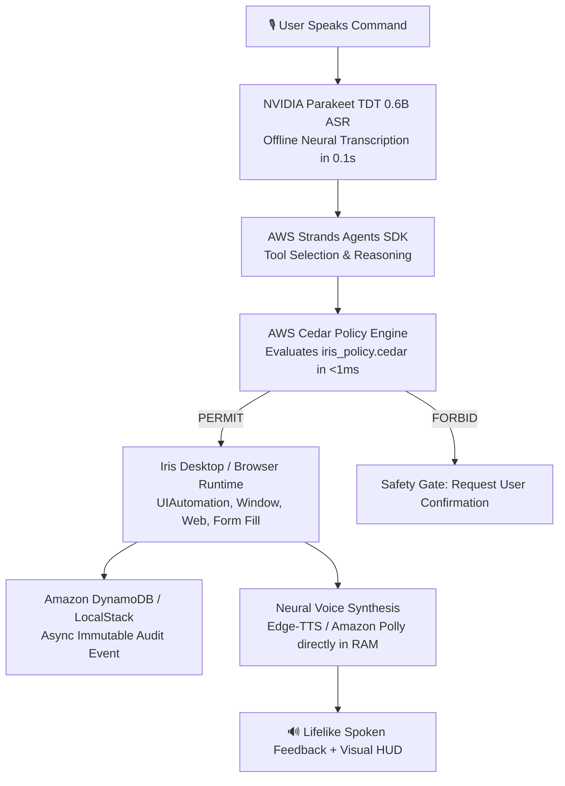

# Iris — AWS Architecture & Integration Guide
### *Digital Braille for the Internet — Powered by the AWS Open-Source & Cloud Ecosystem*

Iris is an accessibility voice operating layer for Windows designed for blind, low-vision, elderly, and digitally illiterate users. This document explains **which AWS technologies are integrated into Iris, where they live in the codebase, and exactly how they work**.

---

## Table of Contents
1. [Hackathon Track Alignment](#1-hackathon-track-alignment)
2. [End-to-End Architecture Flow](#2-end-to-end-architecture-flow)
3. [The 5 AWS Components in Iris](#3-the-5-aws-components-in-iris)
   - [AWS Cedar Engine (Authorization as Policy)](#1-aws-cedar-policy-engine-authorization-as-policy)
   - [AWS Strands Agents SDK (Agent Orchestration)](#2-aws-strands-agents-sdk-agentic-tool-orchestration)
   - [Amazon DynamoDB (Security Audit Ledger)](#3-amazon-dynamodb-tamper-resistant-audit-ledger)
   - [Amazon Bedrock (Foundation Model Reasoning)](#4-amazon-bedrock-converse-api-reasoning)
   - [Amazon Polly & Neural Speech (Audio Narration)](#5-amazon-polly--neural-tts-audio-narration)
4. [Live Visual Telemetry & HUD](#4-live-visual-telemetry--hud)
5. [Zero-Cost Local Parity (No Card, No Bill)](#5-zero-cost-local-parity-no-card-no-bill)
6. [Codebase File Map](#6-codebase-file-map)

---

## 1. Hackathon Track Alignment

Iris directly aligns with the **Open source, on your machine (BUILD IT)** track:
> **"NO AWS ACCOUNT, NO CARD, NO BILL."**

Rather than depending solely on hosted cloud services that require a credit card, Iris uses **AWS's official open-source frameworks (`cedarpy`, `strands-agents`)** running directly on your local machine. If cloud credentials are added, Iris automatically scales to cloud-native **Amazon Bedrock**, **Amazon Polly**, and **Amazon DynamoDB** with zero code changes.

---

## 2. End-to-End Architecture Flow



---

## 3. The 5 AWS Components in Iris

### 1. AWS Cedar Policy Engine (Authorization as Policy)
* **Official Tech:** AWS Cedar ([cedarpolicy.com](https://www.cedarpolicy.com/), `cedarpy`)
* **Files:** 
  - [`actions/security/iris_policy.cedar`](file:///c:/Users/Mayank%20Garg/OneDrive/Desktop/Projects/iris-voice-assistant/actions/security/iris_policy.cedar)
  - [`actions/security/cedar_engine.py`](file:///c:/Users/Mayank%20Garg/OneDrive/Desktop/Projects/iris-voice-assistant/actions/security/cedar_engine.py)
  - [`actions/security/policy.py`](file:///c:/Users/Mayank%20Garg/OneDrive/Desktop/Projects/iris-voice-assistant/actions/security/policy.py)
* **What it does:**  
  For an accessibility assistant that has control over the mouse, keyboard, and file system, security cannot rely on hardcoded `if/else` checks. Iris expresses its security rules in **AWS Cedar**, AWS's declarative policy language.
* **How it works:**  
  Before any action executes, `evaluate_cedar_policy()` compiles the request into a Cedar authorization query:
  ```cedar
  // Permit read-only system metrics unconditionally
  permit(
      principal == User::"VoiceUser",
      action in [Action::"SYSTEM_RAM", Action::"SYSTEM_BATTERY", Action::"SYSTEM_CPU"],
      resource == Resource::"System"
  );

  // Forbid dangerous system sabotage or file deletions unless confirmed
  forbid(
      principal,
      action in [Action::"DELETE_FILE", Action::"FORMAT_DISK", Action::"EXEC_SHELL"],
      resource
  ) unless {
      context.confirmed == true
  };
  ```
  The local Rust-powered engine evaluates this query in `< 1ms` offline.

---

### 2. AWS Strands Agents SDK (Agentic Tool Orchestration)
* **Official Tech:** AWS Strands Agents SDK ([strandsagents.com](https://strandsagents.com/), `strands-agents`)
* **File:** [`actions/strands_agent.py`](file:///c:/Users/Mayank%20Garg/OneDrive/Desktop/Projects/iris-voice-assistant/actions/strands_agent.py)
* **What it does:**  
  Strands Agents is the official open-source AI agent framework built by AWS teams. Iris uses Strands to wrap native Windows automation primitives into model-ready tools.
* **Registered Tools:**
  1. `check_system_memory`: Real-time RAM percentage and usage.
  2. `open_application`: Safe app launcher for allowlisted Windows software.
  3. `search_internet`: Web search via Google/browser.
  4. `open_website`: URL and domain navigation.
  5. `inspect_screen`: Windows UIAutomation tree inspection & layout-aware OCR.
  6. `fill_form_field`: Fast clipboard-injected input filling.
  7. `click_screen_element`: Layout-aware element clicking.
  8. `adjust_volume`: Audio level adjustment.

---

### 3. Amazon DynamoDB (Tamper-Resistant Audit Ledger)
* **Official Tech:** Amazon DynamoDB via `boto3` / LocalStack
* **Files:**
  - [`actions/security/dynamo_logger.py`](file:///c:/Users/Mayank%20Garg/OneDrive/Desktop/Projects/iris-voice-assistant/actions/security/dynamo_logger.py)
  - [`actions/security/audit_logger.py`](file:///c:/Users/Mayank%20Garg/OneDrive/Desktop/Projects/iris-voice-assistant/actions/security/audit_logger.py)
* **What it does:**  
  Every voice command, detected intent, Cedar authorization verdict, and outcome is logged for compliance and safety audit.
* **How it works:**  
  `put_audit_event_async()` runs on a non-blocking background thread. It writes structured events to the `IrisSecurityAudit` table without slowing down audio playback by even 1 millisecond:
  - **Partition Key (`session_id`):** `SESSION#2026-09-19`
  - **Sort Key (`timestamp`):** ISO-8601 timestamp
  - **Attributes:** `utterance`, `intent`, `tier`, `outcome`, `reason`, `cedar_decision`

---

### 4. Amazon Bedrock (Converse API Reasoning)
* **Official Tech:** Amazon Bedrock Runtime via `boto3`
* **Files:**
  - [`actions/bedrock_client.py`](file:///c:/Users/Mayank%20Garg/OneDrive/Desktop/Projects/iris-voice-assistant/actions/bedrock_client.py)
  - [`actions/knowledge_actions.py`](file:///c:/Users/Mayank%20Garg/OneDrive/Desktop/Projects/iris-voice-assistant/actions/knowledge_actions.py)
* **What it does:**  
  Provides foundation model reasoning (Claude 3.5 Haiku / Amazon Nova Micro) for compound multi-step commands and general knowledge queries.
* **How it works:**  
  Uses the AWS Bedrock Converse API with streaming latency tracking. If no AWS cloud credentials are provided, it smoothly falls back to Iris's local offline rule engine and OpenRouter free models.

---

### 5. Amazon Polly & Neural TTS (Audio Narration)
* **Official Tech:** Amazon Polly Neural & Edge Neural TTS
* **Files:**
  - [`actions/polly_tts.py`](file:///c:/Users/Mayank%20Garg/OneDrive/Desktop/Projects/iris-voice-assistant/actions/polly_tts.py)
  - [`actions/edge_tts_voice.py`](file:///c:/Users/Mayank%20Garg/OneDrive/Desktop/Projects/iris-voice-assistant/actions/edge_tts_voice.py)
  - [`actions/feedback.py`](file:///c:/Users/Mayank%20Garg/OneDrive/Desktop/Projects/iris-voice-assistant/actions/feedback.py)
* **What it does:**  
  Replaces standard robotic computer speech (`pyttsx3`) with broadcast-quality **Neural deep learning voices** featuring natural human breath pauses and conversational inflection.
* **Dual-Engine Architecture:**
  - **Amazon Polly Neural:** `Aditi`/`Kajal` (Hindi & Indian English), `Joanna` (US English) when AWS keys are configured.
  - **Edge Neural TTS:** `en-IN-NeerjaNeural` / `hi-IN-SwaraNeural` when running 100% locally with zero keys.
  - **Direct RAM Playback:** Audio streams directly in memory via `pygame.mixer` (zero temporary MP3 files on disk).

---

## 4. Live Visual Telemetry & HUD

Iris includes a live terminal telemetry display and on-screen HUD pill so that users, low-vision assistants, and hackathon judges can **see AWS working in real time**:

```text
================================================================================
  IRIS — Hands-Free Voice Operating Layer for Windows
  Architecture: AWS Open-Source & Enterprise Cloud Accessibility Ecosystem
================================================================================
  🛡️  AWS Cedar Policy Engine  : ACTIVE (Local Rust Engine)
  🤖  AWS Strands Agents SDK   : LOADED (8 Accessibility Tools)
  💾  Amazon DynamoDB Audit    : AWS CLOUD READY (us-east-1) / LOCALSTACK
  🧠  Amazon Bedrock Reasoning: CONVERSE API READY
  🔊  Amazon Polly Narration   : ACTIVE NEURAL (Zero Keys Required)
================================================================================

┌── [AWS ACCESSIBILITY TELEMETRY] ────────────────────────────────────────────┐
│ 🎙️  User Spoken  : "tell me how much RAM used"
│ 🛡️  AWS Cedar    : PERMIT (iris_policy.cedar:L14)
│ 🤖  AWS Strands  : Dispatched tool [check_system_memory]
│ 💾  DynamoDB     : Synced (Table: IrisSecurityAudit)
│ 🔊  Speech Audio : Studio Neural Stream (Direct RAM)
└─────────────────────────────────────────────────────────────────────────────┘
```

---

## 5. Zero-Cost Local Parity (No Card, No Bill)

| AWS Capability | Cloud Mode (Option B) | Open Source / Local Mode (Option A) | Cost |
| :--- | :--- | :--- | :---: |
| **Authorization** | AWS Cedar Engine | `cedarpy` (Local Rust Engine) | **$0.00** |
| **Agent Tools** | AWS Strands Agents | `strands-agents` (Local Python Process) | **$0.00** |
| **Audit Ledger** | Amazon DynamoDB | LocalStack (`localhost:4566`) | **$0.00** |
| **Hearing (ASR)** | Local Parakeet TDT 0.6B | Local Parakeet TDT 0.6B | **$0.00** |
| **Speaking (TTS)**| Amazon Polly Neural | Edge Neural TTS (`en-IN-NeerjaNeural`) | **$0.00** |

---

## 6. Codebase File Map

```
iris-voice-assistant/
├── AWS_INTEGRATION.md              <-- This guide
├── assistant.py                    <-- Main heartbeat: Parakeet ASR + AWS Telemetry Banner
├── actions/
│   ├── security/
│   │   ├── iris_policy.cedar       <-- AWS Cedar policy definitions
│   │   ├── cedar_engine.py         <-- Local Cedar Rust evaluation engine
│   │   ├── dynamo_logger.py        <-- DynamoDB audit persistence (LocalStack + AWS)
│   │   ├── policy.py               <-- Evaluator connecting Cedar to OS actions
│   │   └── audit_logger.py         <-- Dual-writer to DynamoDB and memory
│   ├── strands_agent.py            <-- AWS Strands Agent with 8 @tool definitions
│   ├── polly_tts.py                <-- Amazon Polly Neural synthesizer
│   ├── edge_tts_voice.py           <-- Zero-key Studio Neural TTS synthesizer
│   ├── bedrock_client.py           <-- Amazon Bedrock Converse API client
│   ├── feedback.py                 <-- Prioritized Neural speech router
│   ├── iris_hud.py                 <-- Illuminated terminal card & on-screen toast HUD
│   └── screen_understanding.py     <-- Windows UIAutomation & layout-aware OCR
└── tests/
    ├── test_cedar_policy.py        <-- Unit tests for Cedar authorization
    ├── test_dynamo_logger.py       <-- Unit tests for DynamoDB audit logging
    ├── test_polly_tts.py           <-- Unit tests for Polly synthesizer
    └── test_strands_agent.py       <-- Unit tests for Strands Agent tools
```
