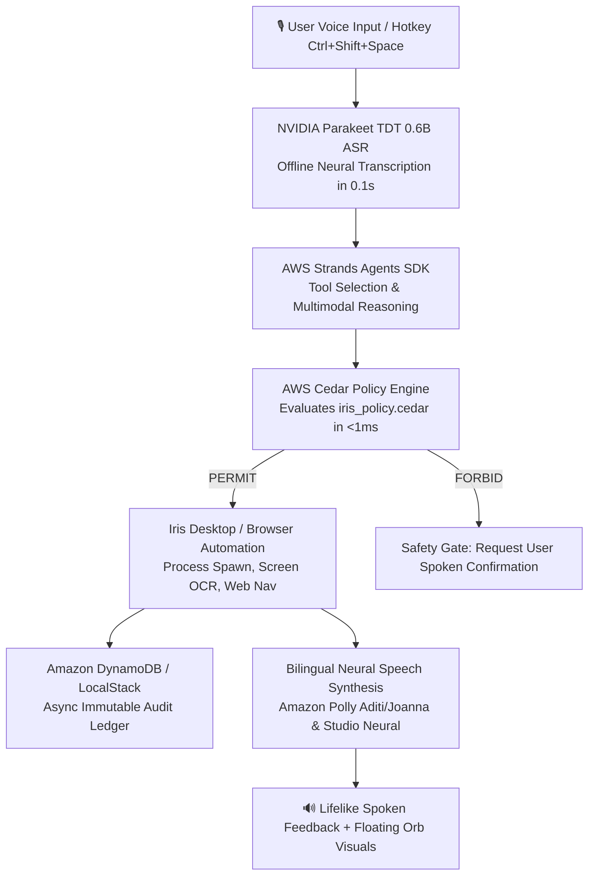

# ⚡ Iris — Digital Braille for the Modern Computing Era

> **A multimodal, voice-first accessibility operating layer bridging the Windows Desktop and the Web.**  
> *Say it, and it happens — hands-free, bilingual, and powered by the AWS Open-Source Ecosystem.*

[](https://github.com/Maayank18/iris-voice-assistant)
[](https://python.org)
[](https://github.com/cedar-policy)
[-10B981)](#bilingual-experience-english--hindi)
[](tests/)
[](LICENSE)

---

## 📑 Table of Contents

- [The Mission & Problem Solved](#-the-mission--problem-solved)
- [System Architecture](#-system-architecture)
- [Core Interfaces](#-core-interfaces)
  - [1. Floating Desktop Orb (Electron + C# Native Launcher)](#1-floating-desktop-orb-electron--c-native-launcher)
  - [2. Browser Companion Extension (Manifest V3)](#2-browser-companion-extension-manifest-v3)
  - [3. Multimodal Screen Vision & OCR](#3-multimodal-screen-vision--ocr)
- [Bilingual Experience: English & Hindi](#-bilingual-experience-english--hindi)
- [AWS Open-Source Stack (BUILD IT Track)](#-aws-open-source-stack-build-it-track)
- [Environment Configuration (.env)](#-environment-configuration-env)
- [Quick Start & Setup](#-quick-start--setup)
- [Voice Command Catalog](#-voice-command-catalog)
- [Safety, Security & Zero-Trust Policies](#-safety-security--zero-trust-policies)
- [Verification & Automated Tests](#-verification--automated-tests)
- [Future Roadmap & Societal Impact](#-future-roadmap--societal-impact)

---

## 🌍 The Mission & Problem Solved

For centuries, the universal answer to *"what if someone cannot see the page or hold the book"* was **Braille** — not merely a translation of text, but a complete reconstruction of the reading interface around a different human sense. 

**The modern digital world never received its Braille.**

Today, essential services — paying electricity bills, booking medical appointments, learning, working, and filing grievances — are locked behind mouse clicks, complex visual hierarchies, and keyboard chords. 

### Who Iris Is Built For:
1. **1.3+ Billion People with Disabilities:** Individuals with motor limitations, tremors, quadriplegia, blindness, low vision, and repetitive strain injury (RSI) who cannot comfortably operate a mouse and keyboard.
2. **250+ Million Low-Literacy & Rural Citizens:** Users who find navigating hierarchical desktop software intimidating, but communicate naturally through spoken voice.
3. **130+ Million Elderly Users:** Seniors who face digital exclusion due to complex desktop user interfaces and multi-window multitasking.
4. **Bilingual & Non-English Communities:** Over 600 million Hindi speakers globally who are alienated by desktop tools that force English-only interaction.

Existing solutions fall short: traditional screen readers (e.g., JAWS: $95+/year) are robotic, expensive, and require memorizing dozens of obscure hotkeys. Mobile assistants are locked inside smartphones without desktop system context. **Iris changes this fundamentally: an always-present, multimodal, bilingual voice operating layer that is 100% free, runs offline, and prioritizes safety with human-in-the-loop confirmation.**

---

## 🏛️ System Architecture

Iris uses a hybrid edge-and-cloud architecture designed to run on any Windows machine with **zero cloud bill and no required API keys**, while scaling dynamically when cloud services are attached:



---

## 💻 Core Interfaces

### 1. Floating Desktop Orb (Electron + C# Native Launcher)
* **Always on Screen:** A hardware-accelerated, transparent, draggable orb anchored to your desktop.
* **Global Hotkey (`Ctrl + Shift + Space`):** Instantly summons or minimizes Iris anywhere across Windows.
* **Expandable Chatbox:** Click once to expand into an interactive conversation window with live transcription, quick-action chips, and real-time status badges (`LISTENING`, `THINKING`, `READY`).
* **Push-to-Talk via Right-Click:** Right-click and hold the Orb to speak; release to execute.

### 2. Browser Companion Extension (Manifest V3)
* **Hands-Free Web Navigation:** Injects an in-page floating accessibility orb (`Alt + Shift + I` or `Ctrl + Shift + Space`) into any webpage.
* **Voice-Driven Actions:** Speak to scroll down/up, jump to top/bottom, highlight interactive links, or read article summaries aloud.
* **Permanent Microphone Permission:** Includes a dedicated setup portal (`permission.html`) that permanently authorizes extension microphone access in 1 click.

### 3. Multimodal Screen Vision & OCR
* **"What is on my screen?":** Uses Windows UIAutomation tree inspection (`uiautomation`) and high-speed layout-aware OCR (`rapidocr-onnxruntime`) to understand open windows, buttons, and documents.
* **Smart Click Targeting:** Automatically identifies button coordinates and safely executes clicks based on natural voice descriptions.

---

## 🇮🇳 Bilingual Experience: English & Hindi

Iris provides first-class support for both **English** and **Hindi (हिन्दी)**. Users can switch modes dynamically with a single click or by speaking naturally:

| Feature | 🌐 English Mode | 🇮🇳 Hindi Mode (हिन्दी) |
| :--- | :--- | :--- |
| **Neural Voice** | Amazon Polly **`Joanna`** / `NeerjaNeural` | Amazon Polly **`Aditi`** / `SwaraNeural` |
| **Orb Interface** | English placeholders & quick-action chips | Hindi catalog: *समय बताओ*, *नोटपैड खोलो*, *स्क्रीनशॉट लो* |
| **Time & Date** | *"The current time is 4:15 PM."* | *"वर्तमान समय शाम के 4:15 बजे है।"* |
| **App Launch** | *"Open Notepad"* → Launches Notepad | *"नोटपैड खोलो"* → तुरंत नोटपैड खुल जाता है |
| **Web Search** | *"Search for AI breakthroughs"* | *"गूगल पर एआई न्यूज़ सर्च करो"* |
| **Screen Reading** | Reads English text & websites aloud | Reads Devanagari Hindi text & articles |

---

## 🛡️ AWS Open-Source Stack (BUILD IT Track)

Iris is engineered specifically for the **"Open Source, On Your Machine (BUILD IT)"** hackathon track: **No AWS Account, No Credit Card, No Cloud Bill.**

1. **AWS Cedar Policy Engine (`cedarpy` / `iris_policy.cedar`):**
   - Declarative, zero-trust security guardrails written in AWS Cedar.
   - Evaluates every voice command locally using the native Rust Cedar engine in **`< 1ms`**.
   - Forbids destructive system calls (arbitrary bash/cmd, disk formatting, recursive deletions) without explicit confirmation.
2. **AWS Strands Agents SDK (`strands-agents`):**
   - AWS's open-source agent framework wrapping Windows OS primitives into structured `@tool` functions (`check_system_memory`, `open_application`, `inspect_screen`, `search_internet`).
3. **LocalStack Local Audit Ledger:**
   - Emulates Amazon DynamoDB at `localhost:4566` to asynchronously log all voice transactions and Cedar decisions into an immutable audit table without requiring cloud credentials.
4. **Cloud-Ready Scaling:**
   - Seamlessly upgrades to cloud-native **Amazon Bedrock (Converse API)** and **Amazon Polly Neural** if AWS credentials are optionally supplied.

---

## ⚙️ Environment Configuration (.env)

Iris works immediately with zero configuration. For advanced reasoning and Q&A features, an optional `.env` file can be configured:

### 1. Copy the template:
```powershell
copy .env.example .env
```

### 2. Environment Variables (.env):
```env
# ==============================================================================
# IRIS ASSISTANT CONFIGURATION (100% FREE LOCAL MODE — BUILD IT TRACK)
# ==============================================================================

# 1. AI Intelligence & Fast Reasoning (OpenRouter Free Tier Models)
# Generate your free key in 30 seconds at: https://openrouter.ai/keys
OPENROUTER_API_KEYS=your_openrouter_api_key_here
OPENROUTER_PRIMARY_MODEL=nex-agi/nex-n2.5-mini:free
OPENROUTER_FALLBACK_MODELS=dots-studio/dots-3-note-preview:free,liquid/lfm-2.5-2.6b:free,google/gemma-4-26b-a4b-it:free
OPENROUTER_TIMEOUT_SEC=4.5

# 2. Local / Cloud Security Audit Configuration (AWS Cedar & DynamoDB)
DYNAMODB_TABLE_NAME=IrisSecurityAudit
AWS_DEFAULT_REGION=eu-north-1
```

> [!NOTE]
> **About the Provided OpenRouter API Keys:**  
> The OpenRouter keys listed above and in `.env.example` are **disposable, shared public test keys** provided explicitly for evaluators, judges, and testers to run Iris immediately with zero setup. They are not private or secret keys. You can also generate your own free personal key in 30 seconds at [openrouter.ai/keys](https://openrouter.ai/keys).

> [!IMPORTANT]
> **No AWS Access Key or Secret Key Required!**  
> In strict alignment with the **BUILD IT Track**, Iris runs on AWS open-source frameworks (`cedarpy`, `strands-agents`, LocalStack) directly on your local machine with **$0 cost, no AWS account, and no credit card**.

---

## 🚀 Quick Start & Setup

### Prerequisites
* **Operating System:** Windows 10 or Windows 11 (64-bit)
* **Python:** Python 3.10 or higher
* **Node.js:** Node.js 18+ (for Electron Desktop Orb)
* **Hardware:** Any standard microphone and speaker/headphones

### 1. Clone & Install Dependencies
```powershell
git clone https://github.com/Maayank18/iris-voice-assistant.git
cd iris-voice-assistant

# Create and activate Python virtual environment
python -m venv .venv
.\.venv\Scripts\Activate.ps1

# Install Python requirements
pip install -r requirements.txt
playwright install chromium
```

### 2. Launch Iris Desktop Orb
```powershell
# Start Desktop Floating Orb GUI
npm run orb

# Or launch directly with Python core
python assistant.py
```

### 3. Install Browser Extension (Chrome / Edge)
1. Open your browser and navigate to `chrome://extensions` or `edge://extensions`.
2. Turn on the **"Developer mode"** toggle in the top-right corner.
3. Click **"Load unpacked"** and select the [`iris-extension`](file:///c:/Users/Mayank%20Garg/OneDrive/Desktop/Projects/iris-voice-assistant/iris-extension) folder.
4. Click **"Grant Microphone Access"** on the welcome tab that appears.
5. Press <kbd>Alt</kbd> + <kbd>Shift</kbd> + <kbd>I</kbd> on any webpage to summon the in-page orb!

---

## 🗣️ Voice Command Catalog

| Category | English Voice Command | Hindi Voice Command (हिन्दी) | Action Performed |
| :--- | :--- | :--- | :--- |
| **System Diagnostics** | *"Tell me how much RAM used"* | *"रैम कितनी इस्तेमाल हो रही है"* | Checks live RAM % and speaks status |
| **App Launching** | *"Open Notepad"* / *"Open Edge"* | *"नोटपैड खोलो"* / *"कैलकुलेटर खोलो"* | Launches allowlisted desktop software |
| **Time & Date** | *"What time is it?"* | *"समय बताओ"* | Speaks accurate localized time |
| **Web Search** | *"Search for Chandrayaan 3"* | *"गूगल पर चंद्रयान सर्च करो"* | Opens Google Search in default browser |
| **Entertainment** | *"Open YouTube"* / *"Play lofi beats"* | *"यूट्यूब खोलो"* / *"गाना चलाओ"* | Navigates to YouTube search/video |
| **Screen Vision** | *"What is on my screen?"* | *"मेरी स्क्रीन पर क्या है"* | OCR analyzes active window elements |
| **Accessibility** | *"Take a screenshot"* | *"स्क्रीनशॉट लो"* | Captures screen via Snipping Tool |
| **Window Control** | *"Minimize window"*, *"Volume up"* | *"आवाज़ बढ़ाओ"*, *"विंडो छोटी करो"* | Adjusts system audio and window state |

---

## 🔒 Safety, Security & Zero-Trust Policies

Iris operates under a strict **Zero-Trust Security Architecture**:

* **AWS Cedar Authorization:** Every action is compiled into a Cedar policy query before execution. High-risk operations require explicit spoken confirmation.
* **Application Allowlisting:** Process spawning is strictly restricted to approved productivity and system applications (Notepad, Calc, Chrome, Edge, VS Code, Task Manager).
* **Sandboxed File Operations:** File creation is sandboxed strictly to the user's `Desktop`, `Documents`, or `~/Iris` folder.
* **Immutable Audit Trail:** All actions, user utterances, and Cedar verdicts are asynchronously written to the `IrisSecurityAudit` table in DynamoDB / LocalStack.
* **No Arbitrary Shell Execution:** Strictly zero `eval()` or unsanitized shell executions.

---

## 🧪 Verification & Automated Tests

Iris features a comprehensive test suite covering intent parsing, Cedar policy enforcement, DynamoDB logging, audio feedback, and screen understanding:

```powershell
# Run the complete test suite
.\.venv\Scripts\python.exe -m pytest tests -q
```
```text
187 passed in 24.84s
```

---

## 🔮 Future Roadmap & Societal Impact

1. **Pan-India Vernacular Expansion:** Expanding neural voice support to 10+ regional languages (Bengali, Tamil, Telugu, Marathi, Gujarati, Kannada).
2. **Offline Edge SLMs:** Deploying quantized local Small Language Models (e.g., Microsoft Phi-3 Mini ONNX) for 100% offline natural language reasoning without external APIs.
3. **E-Governance & Banking Workflows:** Pre-trained voice action templates for public services (DigiLocker, Aadhaar services, pension portals, railway bookings).
4. **Eye-Gaze & Assistive Switch Integration:** Pairing voice with webcam eye-tracking for quadriplegic and non-verbal users.

---

## 📄 License

This project is licensed under the **MIT License** — see the [LICENSE](LICENSE) file for details.

*Built with ❤️ for universal accessibility and the global open-source community.*
